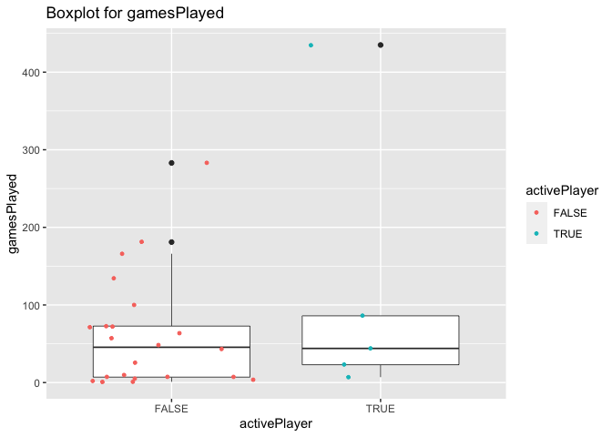

ST558Project1
================
Yuyao Liu
9/16/2020

# Required packages:

Please notice that the packages `httr`, `jsonlite` and `tidyverse` are
required to run the code to create your vignette.

``` r
library(httr)
library(jsonlite)
library(tidyverse)
```

# Query the data

## NHL records API

### List of franchise ID/name

1: “Montréal Canadiens”

2: “Montreal Wanderers”

3: “St. Louis Eagles”

4: “Hamilton Tigers”

5: “Toronto Maple Leafs”

6: “Boston Bruins”

7: “Montreal Maroons”

8: “Brooklyn Americans”

9: “Philadelphia Quakers”

10: “New York Rangers”

11: “Chicago Blackhawks”

12: “Detroit Red Wings”

13: “Cleveland Barons”

14: “Los Angeles Kings”

15: “Dallas Stars”

16: “Philadelphia Flyers”

17: “Pittsburgh Penguins”

18: “St. Louis Blues”

19: “Buffalo Sabres”

20: “Vancouver Canucks”

21: “Calgary Flames”

22: “New York Islanders”

23: “New Jersey Devils”

24: “Washington Capitals”

25: “Edmonton Oilers”

26: “Carolina Hurricanes”

27: “Colorado Avalanche”

28: “Arizona Coyotes”

29: “San Jose Sharks”

30: “Ottawa Senators”

31: “Tampa Bay Lightning”

32: “Anaheim Ducks”

33: “Florida Panthers”

34: “Nashville Predators”

35: “Winnipeg Jets”

36: “Columbus Blue Jackets”

37: “Minnesota Wild”

38: “Vegas Golden Knights”

### For the NHL record API, we have functions to show the endpoints:

### “endpoint”: function

“franchise”: franchise()

“franchise-team-totals” :
franchise\_team\_totals()

### The following endpoints should modify the specific franchise ID or franchise name you want.

“franchise-season-records” : franchise\_season(franchiseID)

“franchise-goalie-records” : franchise\_goalie(franchiseID)

“franchise-skater-records” : franchise\_skater(franchiseID)

``` r
franchise <- function(...){
  full_url <- "https://records.nhl.com/site/api/franchise"
  franchise <- fromJSON(content(GET(full_url), type = "text"), flatten = TRUE)
  franchise$data
}

franchise_team_totals <- function(...){
  full_url <- "https://records.nhl.com/site/api/franchise-team-totals"
  franchise_team_totals <- fromJSON(content(GET(full_url), type = "text"), flatten = TRUE)
  franchise_team_totals$data
}

franchise_season <- function(franchiseID,...){
  if(is.character(franchiseID)){franchiseID <- switch(franchiseID,"Montréal Canadiens" = 1, "Montreal Wanderers" = 2, "St.   Louis Eagles" = 3, "Hamilton Tigers" = 4, "Toronto Maple Leafs" = 5, "Boston Bruins" = 6, "Montreal Maroons" = 7, "Brooklyn Americans" = 8, "Philadelphia Quakers" = 9, "New York Rangers" = 10, "Chicago Blackhawks" = 11, "Detroit Red Wings" = 12, "    Cleveland Barons" = 13, "Los Angeles Kings" = 14, "Dallas Stars" = 15, "Philadelphia Flyers" = 16, "Pittsburgh Penguins" = 17, "St. Louis Blues" = 18, "Buffalo Sabres" = 19, "Vancouver Canucks" = 20, "Calgary Flames" = 21, "New York Islanders" = 22, "New Jersey Devils" = 23, "Washington Capitals" = 24, "Edmonton Oilers" = 25, "Carolina Hurricanes" = 26, "Colorado Avalanche" = 27, "Arizona Coyotes" = 28, "San Jose Sharks" = 29, "Ottawa Senators" = 30, "Tampa Bay Lightning" = 31, "Anaheim Ducks" = 32, "Florida Panthers" = 33, "Nashville Predators" = 34, "Winnipeg Jets" = 35, "Columbus Blue Jackets" = 36, "Minnesota Wild" = 37, "Vegas Golden Knights" = 38)
  }
  base_url <- "https://records.nhl.com/site/api/franchise-season-records"
  full_url <- paste0(base_url,"?cayenneExp=franchiseId=",franchiseID)
  franchise_season <- fromJSON(content(GET(full_url), type = "text"), flatten = TRUE)
  franchise_season$data
}

franchise_goalie <- function(franchiseID,...){
  if(is.character(franchiseID)){franchiseID <-switch(franchiseID,"Montréal Canadiens" = 1, "Montreal Wanderers" = 2, "St.   Louis Eagles" = 3, "Hamilton Tigers" = 4, "Toronto Maple Leafs" = 5, "Boston Bruins" = 6, "Montreal Maroons" = 7, "Brooklyn Americans" = 8, "Philadelphia Quakers" = 9, "New York Rangers" = 10, "Chicago Blackhawks" = 11, "Detroit Red Wings" = 12, " Cleveland Barons" = 13, "Los Angeles Kings" = 14, "Dallas Stars" = 15, "Philadelphia Flyers" = 16, "Pittsburgh Penguins" = 17, "St. Louis Blues" = 18, "Buffalo Sabres" = 19, "Vancouver Canucks" = 20, "Calgary Flames" = 21, "New York Islanders" = 22, "New Jersey Devils" = 23, "Washington Capitals" = 24, "Edmonton Oilers" = 25, "Carolina Hurricanes" = 26, "Colorado Avalanche" = 27, "Arizona Coyotes" = 28, "San Jose Sharks" = 29, "Ottawa Senators" = 30, "Tampa Bay Lightning" = 31, "Anaheim Ducks" = 32, "Florida Panthers" = 33, "Nashville Predators" = 34, "Winnipeg Jets" = 35, "Columbus Blue Jackets" = 36, "Minnesota Wild" = 37, "Vegas Golden Knights" = 38)}
  base_url <- "https://records.nhl.com/site/api/franchise-goalie-records?cayenneExp=franchiseId="
  full_url <- paste0(base_url,franchiseID)
  franchise_goalie <- fromJSON(content(GET(full_url), type = "text"), flatten = TRUE)
  franchise_goalie$data
}

franchise_skater <- function(franchiseID,...){
  if(is.character(franchiseID)){franchiseID <- switch(franchiseID,"Montréal Canadiens" = 1, "Montreal Wanderers" = 2, "St.   Louis Eagles" = 3, "Hamilton Tigers" = 4, "Toronto Maple Leafs" = 5, "Boston Bruins" = 6, "Montreal Maroons" = 7, "Brooklyn Americans" = 8, "Philadelphia Quakers" = 9, "New York Rangers" = 10, "Chicago Blackhawks" = 11, "Detroit Red Wings" = 12, "    Cleveland Barons" = 13, "Los Angeles Kings" = 14, "Dallas Stars" = 15, "Philadelphia Flyers" = 16, "Pittsburgh Penguins" = 17, "St. Louis Blues" = 18, "Buffalo Sabres" = 19, "Vancouver Canucks" = 20, "Calgary Flames" = 21, "New York Islanders" = 22, "New Jersey Devils" = 23, "Washington Capitals" = 24, "Edmonton Oilers" = 25, "Carolina Hurricanes" = 26, "Colorado Avalanche" = 27, "Arizona Coyotes" = 28, "San Jose Sharks" = 29, "Ottawa Senators" = 30, "Tampa Bay Lightning" = 31, "Anaheim Ducks" = 32, "Florida Panthers" = 33, "Nashville Predators" = 34, "Winnipeg Jets" = 35, "Columbus Blue Jackets" = 36, "Minnesota Wild" = 37, "Vegas Golden Knights" = 38)}
  base_url <- "https://records.nhl.com/site/api/franchise-skater-records?cayenneExp=franchiseId="
  full_url <- paste0(base_url,franchiseID)
  franchise_skater <- fromJSON(content(GET(full_url), type = "text"), flatten = TRUE)
  franchise_skater$data
}
```

## NHL stats API

### Please input the endpoint and/or teamID and/or season and modify them in the function to get the data you want.

If you preper one of the team, please input the ID.

NHL\_stats(modifier,teamID= ,season=,…)

For the NHL stats API, we have endpoints shown below:

“?expand=team.roster”

“?expand=person.names”

“?expand=team.schedule.next”

“?expand=team.schedule.previous”

“?expand=team.stats”

“?expand=team.roster\&season=” (You may choose the season you want, such
as“20142015”)

“?teamId=” (You may choose the teamId you want as a string, such
as“4,5,29”)

“?stats=statsSingleSeasonPlayoffs”

``` r
NHL_stats <- function(modifier, season= NA, teamstringID = NA, teamID= NA,...){
  base_url <- "https://statsapi.web.nhl.com/api/v1/teams"
  if (modifier == "?expand=team.roster"){
    full_url <- paste0(base_url,modifier)
    data <- fromJSON(content(GET(full_url), type = "text"), flatten = TRUE)
    data <- data$teams
    roster <- data.frame(id = data[1,]$id,data$roster.roster[[1]])
    for (i in 2:nrow(data)){
      new <- data.frame(id = data[i,]$id,data$roster.roster[[1]])
      roster <- rbind(roster,new)}
      dat <- full_join(data[,-30],roster, by = "id")
      if (!is.na(teamID)){
        dat <- filter(dat, id == teamID)
      }
      return(dat)
  }
    else if (modifier == "?expand=person.names"){
     full_url <- paste0(base_url,modifier)
     dat <- fromJSON(content(GET(full_url), type = "text"), flatten = TRUE)
     dat <- dat$teams
      if (!is.na(teamID)){
        dat <- filter(dat, id == teamID)
      }
      return(dat)
    }
    else if (modifier == "?expand=team.schedule.next") {
     full_url <- paste0(base_url,modifier)
     data <- fromJSON(content(GET(full_url), type = "text"), flatten = TRUE)
     dat <- data$teams
      if (!is.na(teamID)){
        dat <- filter(dat, id == teamID)
      }
      return(dat)
    }
  else if (modifier == "?expand=team.schedule.previous"){
    full_url <- paste0(base_url,modifier)
     data <- fromJSON(content(GET(full_url), type = "text"), flatten = TRUE)
     data <- data$teams
     dates <- data.frame(id=data[1,]$id,data$previousGameSchedule.dates[[1]]$games[[1]])
      for (i in 2:nrow(data)){
      new <- data.frame(id =data[i,]$id,data$previousGameSchedule.dates[[i]]$games[[1]])
      dates <- full_join(dates,new)}
      dat <- full_join(data[,-34],dates, by = "id")
      if (!is.na(teamID)){
        dat <- filter(dat, id == teamID)
      }
      return(dat)
  }
    else if (modifier == "?expand=team.stats"){
    full_url <- paste0(base_url,modifier)
    data <- fromJSON(content(GET(full_url), type = "text"), flatten = TRUE)
    data <- data$teams
    a <- cbind(data[1,-8],data$teamStats[[1]])
    a <- rbind(a,a)
    stats <- cbind(a[,-30], data$teamStats[[1]]$splits[[1]])
    for (i in 2:nrow(data)) {
      a <- cbind(data[i,-8],data$teamStats[[i]])
      a <- rbind(a,a)
      new <- cbind(a[,-30], data$teamStats[[i]]$splits[[1]])
      stats <- rbind(stats, new)
    }
    dat <- stats
     if (!is.na(teamID)){
        dat <- filter(dat, id == teamID)
      }
    return(dat)
    }
    
  else if((modifier == "?expand=team.roster&season=") && (!is.na(season))){
    full_url <- paste0(base_url,modifier,season)
      dat <- fromJSON(content(GET(full_url), type = "text"), flatten = TRUE)
      dat <- dat$teams
    if (!is.na(teamID)){
        dat <- filter(dat, id == teamID)
      }
      return(dat)
  }
  else if((modifier == "?teamId=") && (!is.na(teamstringID))){
    full_url <- paste0(base_url,modifier,teamstringID)
    dat <- fromJSON(content(GET(full_url), type = "text"), flatten = TRUE)
    dat <- dat$teams
    if (!is.na(teamID)){
    dat <- filter(dat, id == teamID)
    }
    return(dat)
  }
  else if (modifier == "?stats=statsSingleSeasonPlayoffs"){
    full_url <- paste0(base_url,modifier)
     dat <- fromJSON(content(GET(full_url), type = "text"), flatten = TRUE)
     dat <- dat$teams
      if (!is.na(teamID)){
        dat <- filter(dat, id == teamID)
      }
      return(dat)
    }
  else{
      stop("Please input the correct modifier")
  }
}
```

## One\_stop\_shop function

Now, we combine these functions to only one. If you are curious about
records API, please let type = “R”, and if you are curious about stats
API, please let type = “S”.

The function one\_stop\_shop works as: one\_stop\_shop(type=,
endpoint=,modifier=,franchise=,season=,teamdstringID=,
teamID=,)

``` r
one_stop_shop <- function(type, endpoint=NA, modifier=NA, franchiseID=NA, season = NA, teamstringID = NA, teamID=NA,...){
  if (type == "R") {
    if (endpoint == "franchise") {
      franchise()}
    else if (endpoint == "franchise-team-totals"){
      franchise_team_totals()
    }
    else if (endpoint == "franchise-season-records") {
      franchise_season(franchiseID)
    }
    else if (endpoint =="franchise-goalie-records") {
      franchise_goalie(franchiseID)}
    else if (endpoint == "franchise-skater-records"){
      franchise_skater(franchiseID)}
    else{stop("Incorrect API type or no match for type and endpoint")}
      }
    else if (type == "S"){
    NHL_stats(modifier,season,teamstringID, teamID)
  }
  else{
    stop("Incorrect API type or no match for type and endpoint")
  }
}
```

# Explore the data

## Join two returned datasets

``` r
join_a <- one_stop_shop("R", endpoint = "franchise-team-totals")
join_b <- one_stop_shop("S", modifier = "?expand=person.names")
join <-  left_join(join_a,join_b,by = "franchiseId")
head(join)
```

    ##   id.x activeFranchise firstSeasonId franchiseId gameTypeId gamesPlayed
    ## 1    1               1      19821983          23          2        2937
    ## 2    2               1      19821983          23          3         257
    ## 3    3               1      19721973          22          2        3732
    ## 4    4               1      19721973          22          3         294
    ## 5    5               1      19261927          10          2        6504
    ## 6    6               1      19261927          10          3         518
    ##   goalsAgainst goalsFor homeLosses homeOvertimeLosses homeTies homeWins
    ## 1         8708     8647        507                 82       96      783
    ## 2          634      697         53                  0       NA       74
    ## 3        11779    11889        674                 81      170      942
    ## 4          857      935         50                  1       NA       90
    ## 5        19863    19864       1132                 73      448     1600
    ## 6         1447     1404        104                  0        1      137
    ##   lastSeasonId losses overtimeLosses penaltyMinutes pointPctg points roadLosses
    ## 1           NA   1181            162          44397    0.5330   3131        674
    ## 2           NA    120              0           4266    0.0039      2         67
    ## 3           NA   1570            159          57422    0.5115   3818        896
    ## 4           NA    133              0           5564    0.0136      8         83
    ## 5           NA   2693            147          85564    0.5125   6667       1561
    ## 6           NA    266              0           8181    0.0000      0        162
    ##   roadOvertimeLosses roadTies roadWins shootoutLosses shootoutWins shutouts
    ## 1                 80      123      592             79           78      193
    ## 2                  0       NA       63              0            0       25
    ## 3                 78      177      714             67           82      167
    ## 4                  2       NA       71              0            0       12
    ## 5                 74      360     1256             66           78      403
    ## 6                  0        7      107              0            0       44
    ##   teamId         teamName.x ties triCode wins id.y               name
    ## 1      1  New Jersey Devils  219     NJD 1375    1  New Jersey Devils
    ## 2      1  New Jersey Devils   NA     NJD  137    1  New Jersey Devils
    ## 3      2 New York Islanders  347     NYI 1656    2 New York Islanders
    ## 4      2 New York Islanders   NA     NYI  161    2 New York Islanders
    ## 5      3   New York Rangers  808     NYR 2856    3   New York Rangers
    ## 6      3   New York Rangers    8     NYR  244    3   New York Rangers
    ##              link abbreviation teamName.y locationName firstYearOfPlay
    ## 1 /api/v1/teams/1          NJD     Devils   New Jersey            1982
    ## 2 /api/v1/teams/1          NJD     Devils   New Jersey            1982
    ## 3 /api/v1/teams/2          NYI  Islanders     New York            1972
    ## 4 /api/v1/teams/2          NYI  Islanders     New York            1972
    ## 5 /api/v1/teams/3          NYR    Rangers     New York            1926
    ## 6 /api/v1/teams/3          NYR    Rangers     New York            1926
    ##      shortName                  officialSiteUrl active            venue.name
    ## 1   New Jersey  http://www.newjerseydevils.com/   TRUE     Prudential Center
    ## 2   New Jersey  http://www.newjerseydevils.com/   TRUE     Prudential Center
    ## 3 NY Islanders http://www.newyorkislanders.com/   TRUE       Barclays Center
    ## 4 NY Islanders http://www.newyorkislanders.com/   TRUE       Barclays Center
    ## 5   NY Rangers   http://www.newyorkrangers.com/   TRUE Madison Square Garden
    ## 6   NY Rangers   http://www.newyorkrangers.com/   TRUE Madison Square Garden
    ##            venue.link venue.city venue.id venue.timeZone.id
    ## 1 /api/v1/venues/null     Newark       NA  America/New_York
    ## 2 /api/v1/venues/null     Newark       NA  America/New_York
    ## 3 /api/v1/venues/5026   Brooklyn     5026  America/New_York
    ## 4 /api/v1/venues/5026   Brooklyn     5026  America/New_York
    ## 5 /api/v1/venues/5054   New York     5054  America/New_York
    ## 6 /api/v1/venues/5054   New York     5054  America/New_York
    ##   venue.timeZone.offset venue.timeZone.tz division.id division.name
    ## 1                    -4               EDT          18  Metropolitan
    ## 2                    -4               EDT          18  Metropolitan
    ## 3                    -4               EDT          18  Metropolitan
    ## 4                    -4               EDT          18  Metropolitan
    ## 5                    -4               EDT          18  Metropolitan
    ## 6                    -4               EDT          18  Metropolitan
    ##   division.nameShort        division.link division.abbreviation conference.id
    ## 1              Metro /api/v1/divisions/18                     M             6
    ## 2              Metro /api/v1/divisions/18                     M             6
    ## 3              Metro /api/v1/divisions/18                     M             6
    ## 4              Metro /api/v1/divisions/18                     M             6
    ## 5              Metro /api/v1/divisions/18                     M             6
    ## 6              Metro /api/v1/divisions/18                     M             6
    ##   conference.name       conference.link franchise.franchiseId
    ## 1         Eastern /api/v1/conferences/6                    23
    ## 2         Eastern /api/v1/conferences/6                    23
    ## 3         Eastern /api/v1/conferences/6                    22
    ## 4         Eastern /api/v1/conferences/6                    22
    ## 5         Eastern /api/v1/conferences/6                    10
    ## 6         Eastern /api/v1/conferences/6                    10
    ##   franchise.teamName        franchise.link
    ## 1             Devils /api/v1/franchises/23
    ## 2             Devils /api/v1/franchises/23
    ## 3          Islanders /api/v1/franchises/22
    ## 4          Islanders /api/v1/franchises/22
    ## 5            Rangers /api/v1/franchises/10
    ## 6            Rangers /api/v1/franchises/10

## Create two new variables

``` r
newData_1 <- one_stop_shop("R",endpoint = "franchise-goalie-records", franchiseID = 30)
newData_1 %>% mutate(winPercen = (1-losses/gamesPlayed)) %>% select(winPercen)
```

    ##    winPercen
    ## 1  0.6137931
    ## 2  0.5911602
    ## 3  0.6466431
    ## 4  0.4285714
    ## 5  0.3239437
    ## 6  0.3461538
    ## 7  0.3472222
    ## 8  0.7674419
    ## 9  0.6000000
    ## 10 0.2812500
    ## 11 0.6927711
    ## 12 0.2857143
    ## 13 0.5000000
    ## 14 1.0000000
    ## 15 0.6140351
    ## 16 0.5625000
    ## 17 0.7014925
    ## 18 0.6400000
    ## 19 0.4285714
    ## 20 0.8571429
    ## 21 0.0000000
    ## 22 0.6521739
    ## 23 1.0000000
    ## 24 0.5479452
    ## 25 0.5813953
    ## 26 0.6000000
    ## 27 0.5454545

``` r
newData_2 <- one_stop_shop("R", endpoint = "franchise")
newData_2 %>% mutate(franchiseName = paste0(teamPlaceName," ",teamCommonName))
```

    ##    id firstSeasonId lastSeasonId mostRecentTeamId teamCommonName teamPlaceName
    ## 1   1      19171918           NA                8      Canadiens      Montréal
    ## 2   2      19171918     19171918               41      Wanderers      Montreal
    ## 3   3      19171918     19341935               45         Eagles     St. Louis
    ## 4   4      19191920     19241925               37         Tigers      Hamilton
    ## 5   5      19171918           NA               10    Maple Leafs       Toronto
    ## 6   6      19241925           NA                6         Bruins        Boston
    ## 7   7      19241925     19371938               43        Maroons      Montreal
    ## 8   8      19251926     19411942               51      Americans      Brooklyn
    ## 9   9      19251926     19301931               39        Quakers  Philadelphia
    ## 10 10      19261927           NA                3        Rangers      New York
    ## 11 11      19261927           NA               16     Blackhawks       Chicago
    ## 12 12      19261927           NA               17      Red Wings       Detroit
    ## 13 13      19671968     19771978               49         Barons     Cleveland
    ## 14 14      19671968           NA               26          Kings   Los Angeles
    ## 15 15      19671968           NA               25          Stars        Dallas
    ## 16 16      19671968           NA                4         Flyers  Philadelphia
    ## 17 17      19671968           NA                5       Penguins    Pittsburgh
    ## 18 18      19671968           NA               19          Blues     St. Louis
    ## 19 19      19701971           NA                7         Sabres       Buffalo
    ## 20 20      19701971           NA               23        Canucks     Vancouver
    ## 21 21      19721973           NA               20         Flames       Calgary
    ## 22 22      19721973           NA                2      Islanders      New York
    ## 23 23      19741975           NA                1         Devils    New Jersey
    ## 24 24      19741975           NA               15       Capitals    Washington
    ## 25 25      19791980           NA               22         Oilers      Edmonton
    ## 26 26      19791980           NA               12     Hurricanes      Carolina
    ## 27 27      19791980           NA               21      Avalanche      Colorado
    ## 28 28      19791980           NA               53        Coyotes       Arizona
    ## 29 29      19911992           NA               28         Sharks      San Jose
    ## 30 30      19921993           NA                9       Senators        Ottawa
    ## 31 31      19921993           NA               14      Lightning     Tampa Bay
    ## 32 32      19931994           NA               24          Ducks       Anaheim
    ## 33 33      19931994           NA               13       Panthers       Florida
    ## 34 34      19981999           NA               18      Predators     Nashville
    ## 35 35      19992000           NA               52           Jets      Winnipeg
    ## 36 36      20002001           NA               29   Blue Jackets      Columbus
    ## 37 37      20002001           NA               30           Wild     Minnesota
    ## 38 38      20172018           NA               54 Golden Knights         Vegas
    ##            franchiseName
    ## 1     Montréal Canadiens
    ## 2     Montreal Wanderers
    ## 3       St. Louis Eagles
    ## 4        Hamilton Tigers
    ## 5    Toronto Maple Leafs
    ## 6          Boston Bruins
    ## 7       Montreal Maroons
    ## 8     Brooklyn Americans
    ## 9   Philadelphia Quakers
    ## 10      New York Rangers
    ## 11    Chicago Blackhawks
    ## 12     Detroit Red Wings
    ## 13      Cleveland Barons
    ## 14     Los Angeles Kings
    ## 15          Dallas Stars
    ## 16   Philadelphia Flyers
    ## 17   Pittsburgh Penguins
    ## 18       St. Louis Blues
    ## 19        Buffalo Sabres
    ## 20     Vancouver Canucks
    ## 21        Calgary Flames
    ## 22    New York Islanders
    ## 23     New Jersey Devils
    ## 24   Washington Capitals
    ## 25       Edmonton Oilers
    ## 26   Carolina Hurricanes
    ## 27    Colorado Avalanche
    ## 28       Arizona Coyotes
    ## 29       San Jose Sharks
    ## 30       Ottawa Senators
    ## 31   Tampa Bay Lightning
    ## 32         Anaheim Ducks
    ## 33      Florida Panthers
    ## 34   Nashville Predators
    ## 35         Winnipeg Jets
    ## 36 Columbus Blue Jackets
    ## 37        Minnesota Wild
    ## 38  Vegas Golden Knights

``` r
newData_3 <- one_stop_shop("R", endpoint = "franchise-team-totals")
for (i in 1:nrow(newData_3)) {
  if(is.na(newData_3$roadTies[i])){newData_3$roadTies[i] = 0}
}
road <- newData_3 %>% mutate(roadTotal=roadLosses+roadOvertimeLosses+roadTies+roadWins) 
head(road)
```

    ##   id activeFranchise firstSeasonId franchiseId gameTypeId gamesPlayed
    ## 1  1               1      19821983          23          2        2937
    ## 2  2               1      19821983          23          3         257
    ## 3  3               1      19721973          22          2        3732
    ## 4  4               1      19721973          22          3         294
    ## 5  5               1      19261927          10          2        6504
    ## 6  6               1      19261927          10          3         518
    ##   goalsAgainst goalsFor homeLosses homeOvertimeLosses homeTies homeWins
    ## 1         8708     8647        507                 82       96      783
    ## 2          634      697         53                  0       NA       74
    ## 3        11779    11889        674                 81      170      942
    ## 4          857      935         50                  1       NA       90
    ## 5        19863    19864       1132                 73      448     1600
    ## 6         1447     1404        104                  0        1      137
    ##   lastSeasonId losses overtimeLosses penaltyMinutes pointPctg points roadLosses
    ## 1           NA   1181            162          44397    0.5330   3131        674
    ## 2           NA    120              0           4266    0.0039      2         67
    ## 3           NA   1570            159          57422    0.5115   3818        896
    ## 4           NA    133              0           5564    0.0136      8         83
    ## 5           NA   2693            147          85564    0.5125   6667       1561
    ## 6           NA    266              0           8181    0.0000      0        162
    ##   roadOvertimeLosses roadTies roadWins shootoutLosses shootoutWins shutouts
    ## 1                 80      123      592             79           78      193
    ## 2                  0        0       63              0            0       25
    ## 3                 78      177      714             67           82      167
    ## 4                  2        0       71              0            0       12
    ## 5                 74      360     1256             66           78      403
    ## 6                  0        7      107              0            0       44
    ##   teamId           teamName ties triCode wins roadTotal
    ## 1      1  New Jersey Devils  219     NJD 1375      1469
    ## 2      1  New Jersey Devils   NA     NJD  137       130
    ## 3      2 New York Islanders  347     NYI 1656      1865
    ## 4      2 New York Islanders   NA     NYI  161       156
    ## 5      3   New York Rangers  808     NYR 2856      3251
    ## 6      3   New York Rangers    8     NYR  244       276

## Contingency Tables

``` r
data_4 <- one_stop_shop("S", modifier = "?expand=team.roster", teamID = 1)
table(data_4$position.code, data_4$position.type) %>% knitr::kable(caption = "position.code and position.type information")
```

|   | Defenseman | Forward | Goalie |
| - | ---------: | ------: | -----: |
| C |          0 |       5 |      0 |
| D |          5 |       0 |      0 |
| G |          0 |       0 |      2 |
| L |          0 |       4 |      0 |
| R |          0 |       1 |      0 |

position.code and position.type
information

``` r
data_5 <- one_stop_shop("S", modifier = "?expand=team.roster&season=", season = "20142015")
table(data_5$id, data_5$firstYearOfPlay) %>% knitr::kable(caption = "id and firstYearOfPlay information")
```

|    | 1917 | 1924 | 1926 | 1932 | 1967 | 1970 | 1972 | 1974 | 1979 | 1980 | 1982 | 1991 | 1992 | 1993 | 1995 | 1997 | 1998 | 2000 | 2011 | 2014 |
| -- | ---: | ---: | ---: | ---: | ---: | ---: | ---: | ---: | ---: | ---: | ---: | ---: | ---: | ---: | ---: | ---: | ---: | ---: | ---: | ---: |
| 1  |    0 |    0 |    0 |    0 |    0 |    0 |    0 |    0 |    0 |    0 |    1 |    0 |    0 |    0 |    0 |    0 |    0 |    0 |    0 |    0 |
| 2  |    0 |    0 |    0 |    0 |    0 |    0 |    1 |    0 |    0 |    0 |    0 |    0 |    0 |    0 |    0 |    0 |    0 |    0 |    0 |    0 |
| 3  |    0 |    0 |    1 |    0 |    0 |    0 |    0 |    0 |    0 |    0 |    0 |    0 |    0 |    0 |    0 |    0 |    0 |    0 |    0 |    0 |
| 4  |    0 |    0 |    0 |    0 |    1 |    0 |    0 |    0 |    0 |    0 |    0 |    0 |    0 |    0 |    0 |    0 |    0 |    0 |    0 |    0 |
| 5  |    0 |    0 |    0 |    0 |    1 |    0 |    0 |    0 |    0 |    0 |    0 |    0 |    0 |    0 |    0 |    0 |    0 |    0 |    0 |    0 |
| 6  |    0 |    1 |    0 |    0 |    0 |    0 |    0 |    0 |    0 |    0 |    0 |    0 |    0 |    0 |    0 |    0 |    0 |    0 |    0 |    0 |
| 7  |    0 |    0 |    0 |    0 |    0 |    1 |    0 |    0 |    0 |    0 |    0 |    0 |    0 |    0 |    0 |    0 |    0 |    0 |    0 |    0 |
| 8  |    1 |    0 |    0 |    0 |    0 |    0 |    0 |    0 |    0 |    0 |    0 |    0 |    0 |    0 |    0 |    0 |    0 |    0 |    0 |    0 |
| 9  |    0 |    0 |    0 |    0 |    0 |    0 |    0 |    0 |    0 |    0 |    0 |    0 |    1 |    0 |    0 |    0 |    0 |    0 |    0 |    0 |
| 10 |    0 |    0 |    1 |    0 |    0 |    0 |    0 |    0 |    0 |    0 |    0 |    0 |    0 |    0 |    0 |    0 |    0 |    0 |    0 |    0 |
| 12 |    0 |    0 |    0 |    0 |    0 |    0 |    0 |    0 |    0 |    0 |    0 |    0 |    0 |    0 |    0 |    1 |    0 |    0 |    0 |    0 |
| 13 |    0 |    0 |    0 |    0 |    0 |    0 |    0 |    0 |    0 |    0 |    0 |    0 |    0 |    1 |    0 |    0 |    0 |    0 |    0 |    0 |
| 14 |    0 |    0 |    0 |    0 |    0 |    0 |    0 |    0 |    0 |    0 |    0 |    0 |    1 |    0 |    0 |    0 |    0 |    0 |    0 |    0 |
| 15 |    0 |    0 |    0 |    0 |    0 |    0 |    0 |    1 |    0 |    0 |    0 |    0 |    0 |    0 |    0 |    0 |    0 |    0 |    0 |    0 |
| 16 |    0 |    0 |    1 |    0 |    0 |    0 |    0 |    0 |    0 |    0 |    0 |    0 |    0 |    0 |    0 |    0 |    0 |    0 |    0 |    0 |
| 17 |    0 |    0 |    0 |    1 |    0 |    0 |    0 |    0 |    0 |    0 |    0 |    0 |    0 |    0 |    0 |    0 |    0 |    0 |    0 |    0 |
| 18 |    0 |    0 |    0 |    0 |    0 |    0 |    0 |    0 |    0 |    0 |    0 |    0 |    0 |    0 |    0 |    0 |    1 |    0 |    0 |    0 |
| 19 |    0 |    0 |    0 |    0 |    1 |    0 |    0 |    0 |    0 |    0 |    0 |    0 |    0 |    0 |    0 |    0 |    0 |    0 |    0 |    0 |
| 20 |    0 |    0 |    0 |    0 |    0 |    0 |    0 |    0 |    0 |    1 |    0 |    0 |    0 |    0 |    0 |    0 |    0 |    0 |    0 |    0 |
| 21 |    0 |    0 |    0 |    0 |    0 |    0 |    0 |    0 |    0 |    0 |    0 |    0 |    0 |    0 |    1 |    0 |    0 |    0 |    0 |    0 |
| 22 |    0 |    0 |    0 |    0 |    0 |    0 |    0 |    0 |    1 |    0 |    0 |    0 |    0 |    0 |    0 |    0 |    0 |    0 |    0 |    0 |
| 23 |    0 |    0 |    0 |    0 |    0 |    1 |    0 |    0 |    0 |    0 |    0 |    0 |    0 |    0 |    0 |    0 |    0 |    0 |    0 |    0 |
| 24 |    0 |    0 |    0 |    0 |    0 |    0 |    0 |    0 |    0 |    0 |    0 |    0 |    0 |    1 |    0 |    0 |    0 |    0 |    0 |    0 |
| 25 |    0 |    0 |    0 |    0 |    0 |    0 |    0 |    0 |    0 |    0 |    0 |    0 |    0 |    1 |    0 |    0 |    0 |    0 |    0 |    0 |
| 26 |    0 |    0 |    0 |    0 |    1 |    0 |    0 |    0 |    0 |    0 |    0 |    0 |    0 |    0 |    0 |    0 |    0 |    0 |    0 |    0 |
| 28 |    0 |    0 |    0 |    0 |    0 |    0 |    0 |    0 |    0 |    0 |    0 |    1 |    0 |    0 |    0 |    0 |    0 |    0 |    0 |    0 |
| 29 |    0 |    0 |    0 |    0 |    0 |    0 |    0 |    0 |    0 |    0 |    0 |    0 |    0 |    0 |    0 |    0 |    0 |    1 |    0 |    0 |
| 30 |    0 |    0 |    0 |    0 |    0 |    0 |    0 |    0 |    0 |    0 |    0 |    0 |    0 |    0 |    0 |    0 |    0 |    1 |    0 |    0 |
| 52 |    0 |    0 |    0 |    0 |    0 |    0 |    0 |    0 |    0 |    0 |    0 |    0 |    0 |    0 |    0 |    0 |    0 |    0 |    1 |    0 |
| 53 |    0 |    0 |    0 |    0 |    0 |    0 |    0 |    0 |    0 |    0 |    0 |    0 |    0 |    0 |    0 |    0 |    0 |    0 |    0 |    1 |

id and firstYearOfPlay
information

``` r
data_6 <- one_stop_shop("S", modifier = "?expand=team.schedule.previous")
table(data_6$venue.timeZone.id, data_6$division.id) %>% knitr::kable(caption = "venue.timeZone.id and division.id information")
```

|                      | 15 | 16 | 17 | 18 |
| -------------------- | -: | -: | -: | -: |
| America/Chicago      |  0 |  5 |  0 |  0 |
| America/Denver       |  1 |  1 |  0 |  0 |
| America/Detroit      |  0 |  0 |  1 |  0 |
| America/Edmonton     |  1 |  0 |  0 |  0 |
| America/Los\_Angeles |  4 |  0 |  0 |  0 |
| America/Montreal     |  0 |  0 |  1 |  0 |
| America/New\_York    |  0 |  0 |  5 |  8 |
| America/Phoenix      |  1 |  0 |  0 |  0 |
| America/Toronto      |  0 |  0 |  1 |  0 |
| America/Vancouver    |  1 |  0 |  0 |  0 |
| America/Winnipeg     |  0 |  1 |  0 |  0 |

venue.timeZone.id and division.id
information

## Numerical Summaries

``` r
newData_1 %>% group_by(activePlayer) %>% summarise(avg = mean(gamesPlayed), med = median(gamesPlayed), var = var(gamesPlayed), IQR = IQR(gamesPlayed)) %>% knitr::kable()
```

| activePlayer |       avg |  med |       var |   IQR |
| :----------- | --------: | ---: | --------: | ----: |
| FALSE        |  61.90909 | 45.5 |  5336.372 | 65.75 |
| TRUE         | 119.00000 | 44.0 | 32082.500 | 63.00 |

``` r
newData_3 %>% group_by(gameTypeId) %>% summarise(avg = mean(gamesPlayed), med = median(gamesPlayed), var = var(gamesPlayed)) %>% knitr::kable()
```

| gameTypeId |       avg |  med |        var |
| ---------: | --------: | ---: | ---------: |
|          2 | 2028.5614 | 1511 | 4080134.43 |
|          3 |  190.4792 |  133 |   39910.55 |

``` r
newData_1 %>% group_by(activePlayer) %>% summarise(avg = mean(wins), med = median(wins), var = var(wins), quantile_25 = quantile(wins, probs = 0.25)) %>% knitr::kable()
```

| activePlayer |      avg |  med |      var | quantile\_25 |
| :----------- | -------: | ---: | -------: | -----------: |
| FALSE        | 24.18182 |  9.5 | 1316.537 |            1 |
| TRUE         | 53.20000 | 20.0 | 7020.700 |           11 |

## Plots

### (1) Bar Plot

The value first increased in around 1926 and reached its highest level
in around 1967. After that, the value waved and had peaks in 1979, 1990,
and 1997.

``` r
data_7 <- one_stop_shop(type = "S", modifier = "?expand=team.stats")
g1 <- ggplot(data = data_7, aes(x=firstYearOfPlay))
g1 + geom_bar() + labs(x = "First Year Of Play")
```

<!-- -->

### (2) Histogram

This histogram is right skewed, which means the losses number of most
team are below 50.

``` r
g2<-ggplot(newData_1,aes(x=losses, y =..density..))
g2+geom_histogram(bins = 20)+geom_density(adjust = 0.4,color="red",lwd=2,outline.type = "full")+labs(y="Density",title = "Histogram for Losses Number")
```

<!-- -->

### (3) Box Plot

The min, first quantile, median, third quantile, and max values of games
played with active players are all greater than that without active
players.

``` r
g3<- ggplot(newData_1,aes(x=activePlayer,y= gamesPlayed))
g3+geom_boxplot(size=0.3)+geom_point(position = "jitter",aes(group = activePlayer, col= activePlayer),size=1)+labs(title = "Boxplot for gamesPlayed")
```

<!-- -->

### (4) Scatter Plot

There seems to be a linear relationship between the number of shutouts
and wins. Theoratcally, the more wins a team has, the more shutouts it
possibaly creats.

``` r
g4<-ggplot(newData_3,aes(group=gameTypeId,x = shutouts, y = wins))
g4+geom_point(aes(color =gameTypeId),size=1)+geom_smooth(method = lm,color = "red")+labs(title = "Shutouts vs Wins") 
```

<!-- -->

### (5) Bar Plot

According to the ggplot, the number of falses on active players is about
three times the number of trues on active players.

``` r
g5 <- ggplot(data = newData_1, aes(x=activePlayer))
g5 + geom_bar() + labs(x = "Number of Active Players")
```

<!-- -->

### (6) Histogram

This histogram is right-skewed, which means the majority number of most
wins in one season are below 5. The record of most wins hits at around
40.

``` r
g6<-ggplot(newData_1,aes(x=mostWinsOneSeason, y =..density..))
g6+geom_histogram(bins = 20)+geom_density(adjust = 0.4,color="red",lwd=2,outline.type = "full")+labs(y="Density",title = "Histogram for Most Wins One Season")
```

<!-- -->
